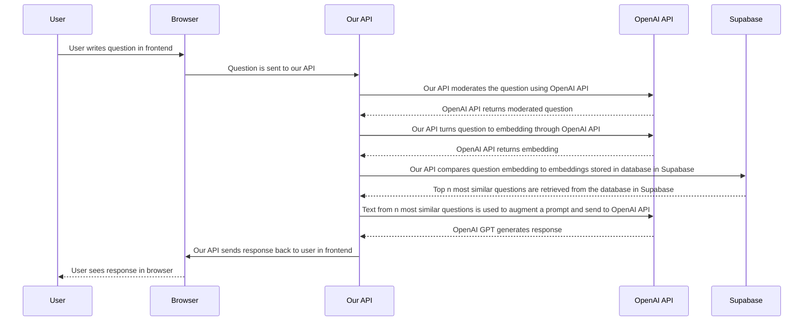

<!-- ALL-CONTRIBUTORS-BADGE:START - Do not remove or modify this section -->

[](#contributors-)

<!-- ALL-CONTRIBUTORS-BADGE:END -->

# _>Parla (frontend)_

This is a the frontend for the project _>Parla_. Currently we explore if we can make the parliamentary documentation provided by the "The Abgeordnetenhaus" of Berlin as open data https://www.parlament-berlin.de/dokumente/open-data more accessible by embedding all the data and do search it using vector similarity search. The project is heavily based on [this example](https://github.com/supabase-community/nextjs-openai-doc-search) from the supabase community. Built with [Next.js](https://nextjs.org/) deployed on vercel.com.

## How it works with retrieval-augmented generation (RAG)



## Prerequisites

- vercel.com account
- supabase.com account
- running instance of the related API and database https://github.com/technologiestiftung/parla-api
- Populated database. Using these tools https://github.com/technologiestiftung/parla-document-processor

## Needed Environment Variables

```plain
NEXT_PUBLIC_PARLA_API_URL=https://domain-of-your-api-server.dev
```

## Installation

```bash
npm ci
```

## Deploy

Assuming you have a vercel.com account and you are logged in.

```bash
# does the first deployment and project creation
npx vercel
# add your env variables (interactive)
npx vercel env add NEXT_PUBLIC_PARLA_API_URL
# deploy again for production
npx vercel --prod
```

## Development

First, run the development server:

```bash
npm run dev
```

Open [http://localhost:3000](http://localhost:3000) with your browser to see the result.

You can start editing the page by modifying `src/app/page.tsx`. The page auto-updates as you edit the file.

## Tests

```bash
npm t
```

## Contributing

Before you create a pull request, write an issue so we can discuss your changes.

## Contributors

Thanks goes to these wonderful people ([emoji key](https://allcontributors.org/docs/en/emoji-key)):

<!-- ALL-CONTRIBUTORS-LIST:START - Do not remove or modify this section -->
<!-- prettier-ignore-start -->
<!-- markdownlint-disable -->
<table>
  <tbody>
    <tr>
      <td align="center" valign="top" width="14.28%"><a href="https://fabianmoronzirfas.me"><br /><sub><b>Fabian Morón Zirfas</b></sub></a><br /><a href="https://github.com/technologiestiftung/parla-frontend/commits?author=ff6347" title="Code">💻</a> <a href="#infra-ff6347" title="Infrastructure (Hosting, Build-Tools, etc)">🚇</a> <a href="#design-ff6347" title="Design">🎨</a></td>
      <td align="center" valign="top" width="14.28%"><a href="http://www.awsm.de"><br /><sub><b>Ingo Hinterding</b></sub></a><br /><a href="https://github.com/technologiestiftung/parla-frontend/pulls?q=is%3Apr+reviewed-by%3AEsshahn" title="Reviewed Pull Requests">👀</a> <a href="#content-Esshahn" title="Content">🖋</a> <a href="#ideas-Esshahn" title="Ideas, Planning, & Feedback">🤔</a></td>
      <td align="center" valign="top" width="14.28%"><a href="https://github.com/raphael-arce"><br /><sub><b>Raphael.A</b></sub></a><br /><a href="https://github.com/technologiestiftung/parla-frontend/commits?author=raphael-arce" title="Code">💻</a> <a href="https://github.com/technologiestiftung/parla-frontend/pulls?q=is%3Apr+reviewed-by%3Araphael-arce" title="Reviewed Pull Requests">👀</a> <a href="https://github.com/technologiestiftung/parla-frontend/issues?q=author%3Araphael-arce" title="Bug reports">🐛</a></td>
      <td align="center" valign="top" width="14.28%"><a href="http://vogelino.com"><br /><sub><b>Lucas Vogel</b></sub></a><br /><a href="https://github.com/technologiestiftung/parla-frontend/pulls?q=is%3Apr+reviewed-by%3Avogelino" title="Reviewed Pull Requests">👀</a> <a href="https://github.com/technologiestiftung/parla-frontend/commits?author=vogelino" title="Code">💻</a> <a href="https://github.com/technologiestiftung/parla-frontend/issues?q=author%3Avogelino" title="Bug reports">🐛</a></td>
      <td align="center" valign="top" width="14.28%"><a href="https://github.com/Jaszkowic"><br /><sub><b>Jonas Jaszkowic</b></sub></a><br /><a href="https://github.com/technologiestiftung/parla-frontend/commits?author=Jaszkowic" title="Code">💻</a> <a href="https://github.com/technologiestiftung/parla-frontend/issues?q=author%3AJaszkowic" title="Bug reports">🐛</a> <a href="https://github.com/technologiestiftung/parla-frontend/pulls?q=is%3Apr+reviewed-by%3AJaszkowic" title="Reviewed Pull Requests">👀</a></td>
    </tr>
  </tbody>
</table>

<!-- markdownlint-restore -->
<!-- prettier-ignore-end -->

<!-- ALL-CONTRIBUTORS-LIST:END -->

This project follows the [all-contributors](https://github.com/all-contributors/all-contributors) specification. Contributions of any kind welcome!

## Credits

<table>
  <tr>
    <td>
      Made by <a href="https://citylab-berlin.org/de/start/">
        <br />
        <br />
        
      </a>
    </td>
    <td>
      A project by <a href="https://www.technologiestiftung-berlin.de/">
        <br />
        <br />
        
      </a>
    </td>
    <td>
      Supported by <a href="https://www.berlin.de/rbmskzl/">
        <br />
        <br />
        
      </a>
    </td>
  </tr>
</table>

## Related Projects

- https://github.com/technologiestiftung/parla-api
- https://github.com/technologiestiftung/parla-data-extractor
- https://github.com/technologiestiftung/parla-supabase
- https://github.com/technologiestiftung/oeffentliches-gestalten-gpt-search
- https://github.com/supabase-community/nextjs-openai-doc-search
<!-- touch again -->
